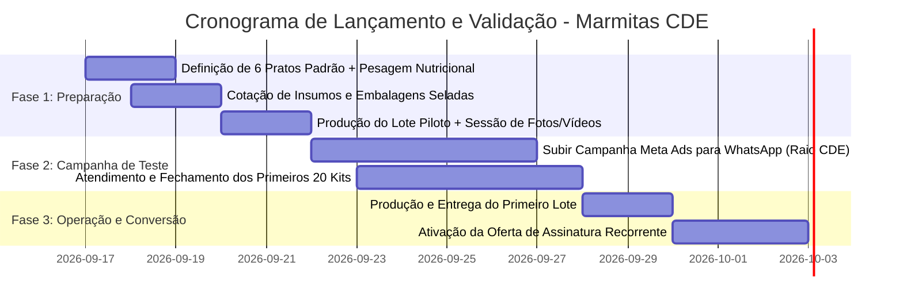

# ESTUDO DE VIABILIDADE E PLANO ESTRATÉGICO
## MARMITAS FITNESS EM CIUDAD DEL ESTE (CDE) - PARAGUAI
**Autor / Conselheiro Estratégico:** AI Business & Growth Advisor  
**Data:** 16 de Setembro de 2026  
**Documento de Apoio:** [DIARIO_DE_BORDO.md](file:///Users/eduardamarques/Desktop/marmitas%20CDE/DIARIO_DE_BORDO.md)

---

## 1. RESUMO EXECUTIVO & DIAGNÓSTICO DO CENÁRIO

O plano visa estruturar um negócio de **Marmitas Fitness em Ciudad del Este (CDE)** focado em:
1. **Pagar as contas fixas** de largada (aluguel do ponto/cozinha + salário da cozinheira).
2. **Escalar para lucro previsível** através de um modelo de recorrência/assinatura semanal e mensal.
3. **Explorar a alavanca de autoridade da Eduarda** (Nutricionista e Personal Trainer), criando um ecossistema integrado de alimentação + prescrição física/nutricional.
4. **Validar rápido com baixo investimento**, sem necessidade de ter dezenas de milhares de seguidores.

---

## 2. ANÁLISE DE MERCADO: O ECOSSISTEMA DE CIUDAD DEL ESTE

Ciudad del Este possui uma dinâmica demográfica e econômica extremamente particular e muito favorável para alimentação saudável pronta, caso o posicionamento seja certeiro:

### Os 3 Públicos de Ouro em CDE:
1. **Estudantes Universitários de Medicina (Público Mais Lucrativo e Imediato):**
   - **Quem são:** Milhares de estudantes brasileiros matriculados em universidades como UPAP, UCP, Maria Serrana, UNIDA, Columbia, etc.
   - **Dores reais:** Moram sozinhos ou em repúblicas, rotina exaustiva de aulas e internato, **não têm tempo nem disposição para cozinhar**, compram muito fast food por falta de opção saudável rápida.
   - **Comportamento financeiro:** A maioria vive com mesada vinda do Brasil, **paga tudo via PIX**, valoriza a previsibilidade financeira mensal (saber quanto vai gastar no mês com comida é um alívio).
2. **Empresários, Comerciantes e Gerentes do Centro de CDE:**
   - Trabalham em regime intenso (muitas vezes almoçam na própria loja/escritório).
   - Comer na rua todo dia no microcentro é caro, pesado e engorda. Marmitas equilibradas entregues no escritório resolvem um problema diário.
3. **Frequentadores de Academias e Moradores de Condomínios (Área 1 a 4, Paraná Country Club em Hernandarias):**
   - Público com alto poder aquisitivo, buscam hipertrofia, emagrecimento ou longevidade, já têm personal ou frequentam academias estruturadas.

---

## 3. VIABILIDADE FINANCEIRA, PREÇOS E MARGEM DE LUCRO

### A. Custos Fixos Estimados (Mensal em CDE)
*Valores de referência de mercado em CDE:*
- **Salário Cozinheira (Paraguai):** 2.800.000 a 3.500.000 PYG (aprox. **R$ 2.000 a R$ 2.400**)
- **Aluguel do Espaço / Cozinha:** R$ 1.500 a R$ 2.200 (dependendo do bairro: Área 1, Km 4, Km 7, etc.)
- **Custos Operacionais (Gás, Água, Energia Elétrica Ande, Internet):** R$ 500 a R$ 700
- **Total de Custos Fixos Base:** **~R$ 4.200 a R$ 5.300 / mês** (Média de trabalho: **R$ 4.800/mês**)

---

### B. Custo de Mercadoria Vendida (CMV Unitário)
No Paraguai, insumos básicos (frango, patinho, ovos, legumes, arroz integral, batata doce) comprados em atacados (Fortis, Box, etc.) têm custo competitivo.
- **Proteína (120g a 150g pesados prontos):** R$ 3,80 a R$ 4,80
- **Carboidrato + Legumes/Fibras (180g a 200g):** R$ 1,50 a R$ 2,20
- **Embalagem termosselada/freezer/micro-ondas + Etiqueta Nutricional:** R$ 1,20 a R$ 1,80
- **Custo Unitário Total (CMV):** **R$ 7,50 a R$ 9,00 por marmita** (Média: **R$ 8,20**)

---

### C. Estratégia de Precificação (Pricing)
Para vender bem em CDE tanto para brasileiros quanto para paraguaios:
- **Preço Avulso / Degustação:** R$ 20,00 a R$ 22,00 (aprox. 30.000 a 33.000 Gs)
- **Pacote Semanal (10 marmitas - Almoço + Janta seg a sex):** R$ 180,00 (R$ 18,00/unid)
- **Plano Mensal / Assinatura (40 marmitas - Almoço e Janta por 4 semanas):** R$ 680,00 (R$ 17,00/unid)
- **Plano Mensal Almoço (20 marmitas):** R$ 360,00 (R$ 18,00/unid)

---

### D. Margens e Ponto de Equilíbrio (Break-Even)
- **Preço Médio de Venda:** R$ 18,00
- **CMV Médio:** R$ 8,20
- **Margem de Contribuição por marmita:** **R$ 9,80 (54,4% de margem)**

#### 🎯 Ponto de Equilíbrio (Quantas marmitas pagam as contas?):
$$\text{Break-even} = \frac{\text{Custos Fixos (R\$ 4.800)}}{\text{Margem por Unidade (R\$ 9,80)}} \approx \mathbf{490\text{ marmitas/mês}}$$

> **O que isso significa na prática?**  
> 490 marmitas no mês representam apenas:
> - **12 a 13 clientes** no plano de 40 marmitas/mês (almoço + janta), **OU**
> - **24 a 25 clientes** no plano de 20 marmitas/mês (só almoço).
> 
> Ou seja: **Com apenas 20 a 25 clientes ativos fixos, você já zera 100% dos custos da cozinheira e do aluguel da cozinha!**

---

### E. Projeções de Faturamento e Lucro Líquido

| Nível de Escala | Clientes Ativos (Média 25 marmitas/mês) | Marmitas / Mês | Faturamento Bruto | Custo Mercadoria (CMV) | Custos Fixos | Verba Anúncios / Logística | **Lucro Líquido Estimado** |
|---|---|---|---|---|---|---|---|
| **Fase 1: Break-even** | 20 clientes | ~500 un. | R$ 9.000 | R$ 4.100 | R$ 4.800 | R$ 500 | **Empatado (R$ -400 a +400)** |
| **Fase 2: Validação & Tração** | 40 clientes | ~1.000 un. | R$ 18.000 | R$ 8.200 | R$ 5.000 | R$ 1.200 | **R$ 3.600 a R$ 4.200** |
| **Fase 3: Operação Otimizada** | 80 clientes | ~2.000 un. | R$ 36.000 | R$ 16.400 | R$ 6.000* | R$ 2.000 | **R$ 11.600 a R$ 13.000** |
| **Fase 4: Capacidade Máxima Cozinha** | 150 clientes | ~3.750 un. | R$ 67.500 | R$ 30.750 | R$ 9.000** | R$ 4.000 | **R$ 23.000 a R$ 26.000** |

*\*Na Fase 3 adiciona-se ajudante meio período ou bonificação de produtividade.*  
*\*\*Na Fase 4 adiciona-se segunda cozinheira e estrutura maior.*

---

## 4. ASSINATURA VS. AVULSO: QUAL O MODELO CORRETO?

### ⚠️ A Armadilha da "Assinatura Direta"
Se você tentar forçar um cliente desconhecido na internet a assinar um contrato mensal de R$ 680 de cara, **a conversão será baixa**. Por quê?
- Ele não sabe se a comida é gostosa.
- Ele não sabe se o tempero é bom ou se vem pouca proteína.
- Ele tem medo de enjoar da comida congelada.

### ✅ O Modelo Vencedor: A Escada da Recorrência
1. **Front-End (A Isca de Entrada):**
   - **"Kit Degustação / Experiência 5 Dias" (5 marmitas para o almoço da semana - Seg a Sex por R$ 99)** ou **Kit 10 Marmitas (Almoço + Jantar por R$ 180)**.
   - O cliente entra com baixo risco e descobre que a comida é deliciosa.
2. **Back-End (Conversão para Assinatura):**
   - Na quinta-feira (4º dia do kit), o suporte do WhatsApp envia uma mensagem humanizada:
     > *"Oi [Nome], tudo bem? Vi que hoje você tem a última marmita do seu kit de 5 dias! Para você não ficar sem almoço na segunda-feira e não ter o trabalho de pedir toda semana, abrimos nossa lista VIP de Assinantes Semanais. Você garante o cardápio da próxima semana com entrega automática todo domingo/segunda, escolhe os pratos e ganha frete grátis + o cardápio ajustado pela Nutricionista Eduarda. Vamos deixar o seu pacote de 10 da próxima semana agendado?"*
   - Mais de **40% a 55% dos clientes recorrem** quando a comida é boa e o pós-venda é proativo.

---

## 5. SINERGIA ESTRATÉGICA: EDUARDA (NUTRICIONISTA & PERSONAL) + MARMITAS

A presença da Eduarda é o maior **diferencial competitivo** da operação. Nenhuma marmitaria comum de CDE tem uma Personal e Nutricionista como cara do negócio.

### Quem lança quem? (A resposta do ecossistema)
A resposta não é "ou um ou outro", mas sim um **Funil de Mão Dupla**:

```
                  ┌──────────────────────────────────────────────┐
                  │          ECOSSISTEMA EDUARDA + MARMITAS      │
                  └──────────────────────────────────────────────┘
                                         ▲
                                         │
                 ┌───────────────────────┴───────────────────────┐
                 │                                               │
    [ ENTRADA VIA MARMITAS ]                         [ ENTRADA VIA EDUARDA ]
   Cliente quer comer prático.                      Paciente quer emagrecer/treinar.
   Comprou pacote de 10 marmitas.                   Eduarda passa o plano alimentar/treino.
                 │                                               │
                 ▼                                               ▼
         [ CROSS-SELL ]                                  [ CROSS-SELL ]
   "Ganhe 1 Avaliação Corporal /                    "Não tem tempo de cozinhar a dieta?
    Bioimpedância ou 30% OFF na                      Nossa cozinha própria entrega as suas
    consultoria com a Nutri Eduarda"                 marmitas pesadas exatamente na gramatura"
                 │                                               │
                 └───────────────────────┬───────────────────────┘
                                         ▼
                               [ CLIENTE LTV MÁXIMO ]
                     Paga Marmita Recorrente (R$ 680/mês)
                   + Consultoria/Personal Eduarda (R$ 200-400/mês)
```

### Por que isso destrói a concorrência?
- **Para o cliente de consultoria da Eduarda:** O maior motivo de abandono de dieta é "falta de tempo para cozinhar e pesar comida". Ao entregar o cardápio pronto, a taxa de sucesso do paciente dispara, e a retenção dele como aluno aumenta.
- **Para o cliente da marmita:** Ele não está comprando uma "quentinha barata". Ele está comprando **"Alimentação calculada e assinada por uma nutricionista"**. Isso permite cobrar R$ 18 a R$ 22 sem sofrer comparação com o buffet por quilo da esquina.

---

## 6. MARKETING: E-BOOK X TRÁFEGO DIRETO (O QUE REALMENTE FUNCIONA?)

### ❌ Por que NÃO começar com E-book?
O usuário questionou se seria bom começar com um e-book. Como conselheiro estratégico, a recomendação é: **NÃO use e-book como porta de entrada de vendas de marmitas**.
- **O motivo:** Quem baixa e-book de receitas ou de dieta é a pessoa que quer cozinhar em casa ou está apenas pesquisando curiosidades. 
- Quem compra marmita pronta é a pessoa com **pressa, sem tempo, com dinheiro na mão e fome imediata**. Ela não quer ler um PDF; ela quer a comida na mesa dela.
- **Onde o e-book pode entrar:** Como **bônus de valor percebido** para quem fecha o plano mensal ("Assine o plano mensal e ganhe o Guia de Hábitos & Treinos Rápidos da Nutri Eduarda").

---

### ✅ O Teste Rápido de 7 a 10 Dias (Sem Perfil Grande e com Baixo Custo)
Para validar a demanda antes de gastar rios de dinheiro em reformas:

#### 1. Tráfego Pago Hiperlocal no Meta Ads (Instagram/Facebook)
- **Orçamento:** Apenas **R$ 25 a R$ 35 / dia** durante 7 dias (Investimento total: ~R$ 200 a R$ 250).
- **Segmentação Geográfica (Raio Estratégico):**
  - Raio de 3 a 5 km cobrindo: Faculdades de Medicina em CDE (Km 4 ao Km 8, UPAP, UCP, etc.), bairros residenciais onde estudantes moram (Área 1, Área 2, Km 7, microcentro) e Hernandarias próximo aos condomínios.
  - Idade: 19 a 45 anos.
  - Idioma: Português e Espanhol.
- **Formato do Anúncio (Vídeo de 15 a 30 segundos gravado no celular):**
  - **Hook (Gancho nos 3 primeiros segundos):** *"Cansado de gastar com comida ruim no centro de CDE ou perder horas cozinhando depois da faculdade?"*
  - **Demonstração visual:** Mostre a marmita sendo aberta, a fumacinha saindo, carne suculenta, legumes frescos, nada daquela aparência sem graça de comida de hospital.
  - **Autoridade:** *"Refeições saudáveis, saborosas e com a quantidade exata de proteínas calculadas pela Nutricionista Eduarda."*
  - **Oferta de Teste:** *"Experimente nosso Kit Degustação da Semana com entrega grátis no seu condomínio ou faculdade. Toque no botão abaixo e receba o cardápio pelo WhatsApp."*
- **Destino do Anúncio:** Link direto para o **WhatsApp Business** com mensagem pré-configurada:
  > *"Olá! Vi o anúncio das marmitas fitness em CDE e quero ver o cardápio e os kits da semana!"*

#### 2. Ações de Guerrilha de Custo Zero em CDE:
- **Atléticas e Grupos de WhatsApp de Medicina:** Fazer contato com os diretores de atlética ou representantes de sala das faculdades (UCP, UPAP) oferecendo cupom de 10% para os alunos da turma.
- **Parcerias com Academias Locais:** Levar 10 marmitas cortesia para os professores e donos de academias de CDE provarem. Se o personal aprovar o sabor, ele mesmo indica os alunos dele para você.

---

## 7. LOGÍSTICA & OPERAÇÃO PRÁTICA EM CDE: COMO ENTREGAR?

A logística é o coração da lucratividade de qualquer operação de marmitas. Existem 3 modelos possíveis no mercado, mas apenas um deles faz sentido para o seu objetivo financeiro:

### Comparativo dos Modelos:
| Modelo | Viabilidade em CDE | Custo de Frete | Estresse Operacional | Veredito |
|---|---|---|---|---|
| **1. Entrega Diária (Quente - Seg a Sex)** | 🔴 **Péssima** | Altíssimo (20 fretes/mês = ~R$ 100 a 160 por cliente) | **Caótico:** todo mundo quer receber entre 11h30 e 12h30 simultaneamente. Trânsito do Km 4/Centro trava entregas. | **NÃO FAZER!** Destrói sua margem de lucro. |
| **2. Entrega em Lote (Congeladas - 1x ou 2x/sem)** | 🟢 **Excelente (Recomendado)** | Baixo (4 a 8 fretes/mês = diluído no pedido) | **Calmo:** você entrega no domingo à noite ou segunda de manhã, com janela de 4 horas sem correria de almoço. | **MODELO CAMPEÃO.** Margem alta e previsibilidade. |
| **3. Ponto de Retirada (Takeaway / Balcão)** | 🟡 **Excelente como Apoio** | Zero custo para você | Zero estresse. O cliente busca na sua cozinha ou no consultório da Eduarda. | **Manter como opção**, oferecendo R$ 10 de desconto ou 1 marmita extra. |

### A Operação Recomendada em CDE:
1. **Padrão: 2 Entregas por Semana (Segunda e Quarta-Feira):**
   - **Por que não 1 vez só?** Muitos estudantes de medicina em CDE moram em quitinetes com frigobar ou geladeiras com congelador pequeno. Colocar 10 ou 14 marmitas de uma vez pode faltar espaço.
   - Entregar **Segunda-feira** (almoço/janta de seg, ter e qua) e **Quarta-feira** (almoço/janta de qui, sex e sab) resolve o espaço do cliente e mantém o frescor percebido no nível máximo.
   - Para quem tem geladeira grande com freezer normal, a opção de **1 entrega única semanal (Segunda-feira)** é disponibilizada com frete mais barato.
2. **Contratação de Motoboy Terceirizado:**
   - Em CDE não compensa ter motoboy com carteira assinada no início.
   - Contrata-se um motoboy parceiro com rota fechada: ele pega 15 a 25 entregas no início do turno (ex: segunda das 08h às 12h) e recebe uma diária fixa ou valor fechado por pacote entregue (ex: 7.000 a 10.000 Gs por parada).

---

## 8. MODELAGEM DE CAC (CUSTO DE AQUISIÇÃO DE CLIENTE) EM CDE

O Custo de Aquisição de Cliente (CAC) em Ciudad del Este é **muito menor** do que em capitais brasileiras (como São Paulo, Curitiba ou Rio de Janeiro), por 3 motivos cruciais:
1. **Leilão de Tráfego Barato:** Menos concorrência anunciando no Meta Ads (Facebook/Instagram) com geolocalização no Paraguai.
2. **Dor Aguda Concentrada:** Estudantes longe da família, sem tempo de cozinhar, cansados de lanche e com dinheiro na mão (Pix).
3. **Poder do "Boca a Boca" no Ecossistema Universitário:** Um estudante que gosta da marmita leva para a faculdade, os colegas de república veem e pedem no mesmo dia (efeito viral orgânico).

### Projeção Numérica do CAC no Meta Ads (Tráfego Pago):
* **CPM Médio em CDE/Foz (Custo por 1.000 impressões):** R$ 8,00 a R$ 14,00
* **CTR Médio (Taxa de Clique no anúncio com vídeo de comida suculenta):** 2,5% a 4,0%
* **Custo por Conversa / Visita no Checkout:** **R$ 1,80 a R$ 3,50**
* **Taxa de Conversão na Landing Page / Cardápio:** 12% a 18% no checkout direto.
* **CAC Estimado no Primeiro Pedido:** **R$ 15,00 a R$ 22,00 por cliente**.

$$\text{Lucro Líquido no 1º Pedido} = \text{R\$ } 180,00 (\text{Kit 10 un}) - \text{R\$ } 82,00 (\text{CMV}) - \text{R\$ } 18,00 (\text{CAC}) = \mathbf{+\text{R\$ } 80,00\text{ no bolso imediato!}}$$

---

## 9. COMO ACABAR COM O ATENDIMENTO MANUAL NO WHATSAPP (SELF-SERVICE 100% AUTOMATIZADO)

Atender cliente no WhatsApp um por um para explicar cardápio, mandar foto, esperar a pessoa escolher prato e cobrar comprovante **é inviável e drena a energia da equipe**.

### A Solução: Landing Page / Cardápio Interativo com Montagem de Kit Automática
Em vez do anúncio mandar para um WhatsApp em branco, o anúncio manda o cliente direto para uma **Página Web Super Rápida e Responsiva para Celular**:

1. **Topo (3 segundos):**
   - *"Marmitas Fitness em CDE assinadas pela Nutricionista Eduarda. Coma saudável sem cozinhar. Entregas em toda CDE e região."*
2. **Passo 1 - Escolha o seu Pacote:**
   - [ ] Kit 5 Refeições (Almoço Seg-Sex): R$ 99
   - [x] Kit 10 Refeições (Almoço + Jantar): R$ 180 *(Mais Vendido)*
   - [ ] Plano Mensal Recorrente (40 Refeições): R$ 680
3. **Passo 2 - Escolha os Pratos do seu Kit:**
   - O cliente clica nos botões `+` e `-` até completar a quantidade do kit escolhido (ex: 4x Frango Grelhado com Batata Doce, 3x Patinho com Arroz Integral, 3x Tilápia ao Forno).
4. **Passo 3 - Restrições Alimentares:**
   - Um campo de múltipla escolha: `[ ] Sem Lactose`, `[ ] Sem Glúten`, `[ ] Sem Cebola`, `[ ] Outro:`
5. **Passo 4 - Dados de Entrega e Pagamento:**
   - Nome, Bairro/Faculdade em CDE e WhatsApp.
   - Opções de Pagamento:
     - **PIX (Chave Copia e Cola / QR Code automático):** Ao pagar, anexa o comprovante direto na tela.
     - **Dinheiro (Reais ou Guaranis na entrega).**
6. **Resultado:** O pedido chega no painel ou no WhatsApp da cozinha **100% fechado e pago**. Ninguém precisa conversar, tirar dúvida ou convencer ninguém!

---

## 10. COMO LIDAR COM RESTRIÇÕES ALIMENTARES E DIETAS ESPECÍFICAS

A pior armadilha para uma cozinha de marmitas é tentar fazer "comida sob medida para cada cliente" cobrando preço padrão. Isso atrasa a produção e estressa a cozinheira.

### A Estratégia dos Grandes Players (Modular & Linhas Claras):
1. **O Cardápio Modular (O cliente monta como quer):**
   - Se o cliente não come peixe, ele não escolhe peixe. Ele escolhe só frango e carne.
   - Se ele não quer carboidrato (dieta Cetogênica/Low Carb), oferecemos a opção de substituir o carboidrato por dobro de legumes.
2. **Linhas Pré-Definidas com Tags Claras:**
   - 🟢 *Linha Tradicional Fit* (Proteína magra + carbo complexo + legumes no vapor)
   - 🟡 *Linha Low Carb* (Proteína + vegetais verdes e abobrinha/cenoura)
   - 🔵 *Sem Glúten & Sem Lactose* (Identificado por selo em cada prato)
3. **E se o cliente quiser uma Dieta Hiper-Específica de Nutricionista?**
   - Esse é o **Plano VIP Personalizado da Eduarda**:
   - A Eduarda atende em consultoria, faz o plano alimentar com as gramaturas exatas que o cliente precisa, e a cozinha produz a porção sob medida dele.
   - **Ticket mais alto:** Cobra-se de **R$ 25 a R$ 28 por marmita** (ou taxa extra de R$ 150/mês). O cliente paga com prazer porque é uma dieta clínica prescrita e entregue pronta.

---

## 11. PLANO DE AÇÃO IMEDIATO (ROTEIRO DE VALIDAÇÃO)



### Checklist dos Próximos Passos:
- [x] Estudo de mercado e cálculo de viabilidade econômica concluído.
- [ ] Definir o cardápio enxuto de lançamento (sugestão: 6 pratos variando frango grelhado, carne moída de patinho e peixe/tilápia).
- [ ] Eduarda define a tabela de macronutrientes padrão (ex: 35g proteína / 40g carbo / fibras).
- [ ] Gravar 3 vídeos curtos no celular com os pratos reais sendo montados.
- [ ] Configurar WhatsApp Business com catálogo e mensagem de saudação automática.
- [ ] Rodar o primeiro teste de tráfego pago de R$ 200.
